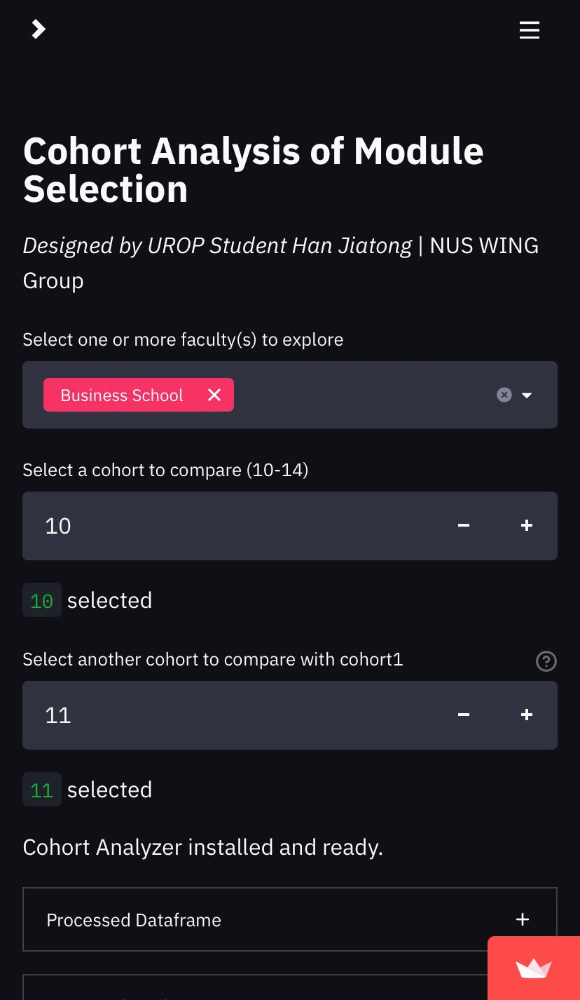
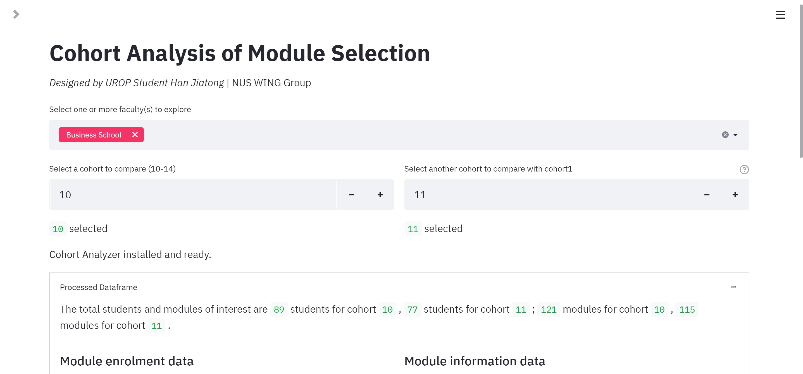

# Module Selection Analysis

<p align="center"></p>

## Introduction

This is repository is intended for provosts and students to visualize course enrolment datasets and compare between cohorts to gain some statistical insights. The toolkit was originally used for [my UROP side quest](https://sway.office.com/j4vQOyVl2jm3uOxv?ref=Link&loc=play) to investigate the effects of the universiy grade-free policy. The datasets were confidential, however, I have hence anonymized all the entries by hash. 

For your reference, my app is publicly shared at [this address](https://jthh-module-selection-analysis-app-nlvm4c.streamlitapp.com/), thanks to Streamlit platform.

## Quick Start

Install visualization and web-app packaging dependencies:
```
pip install -r requirements/requirements.txt
```

Then locally run the app with Streamlit run commands:
```
python -m streamlit run src/app.py
```

You will be redirected to a local address that hosts the app temporarily.

## Customize Your Use

Now the dataset is hidden by a Streamli-native mechanism, using a TOML format file. To use your own datasets, kindly follow the next steps:

1. Prepare datasets by following the format specified in [sheet](data/dataset_format.xlsx);
2. Upload the datasets so as to make them accessible by web links;
2. Deploy your app at Streamlit community. See instructions [here](https://docs.streamlit.io/streamlit-cloud/get-started/deploy-an-app);
3. Configure the TOML file from which directory you run the app. Make sure to include the lines:
    ```
    PATH_MOD = 'path-to-modules.csv'
    PATH_STU = 'path-to-programs.csv'
    ```
4. Launch the app and you will be able to see the magic.


## Feedback
If you encounter any issue when preparing your own datasets or running the codes, please raise an issue in this repository. I will get to it very soon. Thanks!